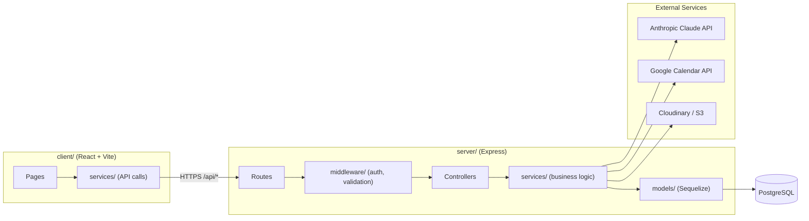
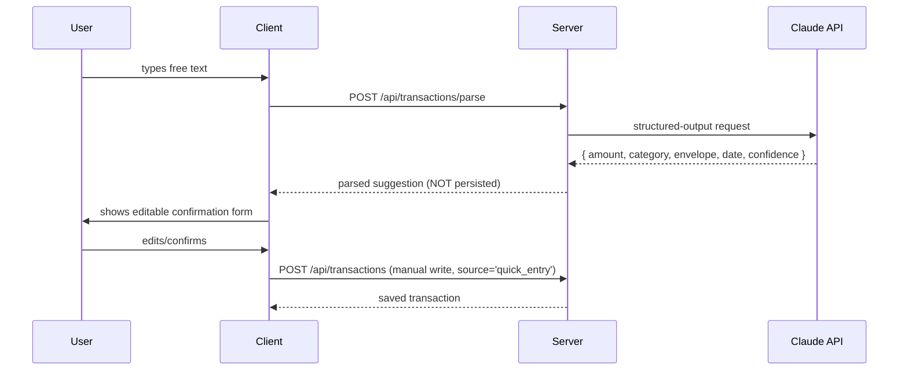
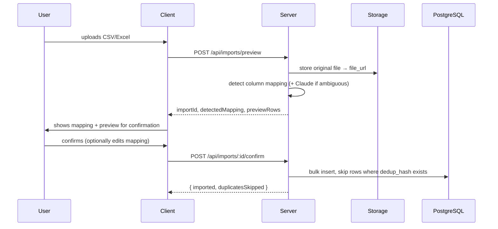
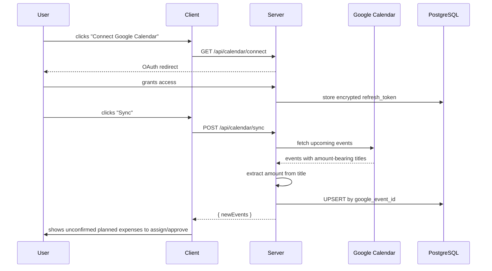

# Buddgy — Architecture

## Contents

| Section | What's in it |
|---|---|
| [Layer Topology](#layer-topology) | Client / server / DB / external services, at a glance |
| [Request Lifecycle](#request-lifecycle) | How a typical authenticated request flows |
| [Folder Structure](#folder-structure) | Where things live (mirrors `CLAUDE.md`) |
| [Input Channel: AI Quick Entry](#input-channel-ai-quick-entry) | Free text → confirm → save |
| [Input Channel: CSV Import](#input-channel-csv-import) | Upload → preview → confirm → bulk insert |
| [Input Channel: Calendar Sync](#input-channel-calendar-sync) | OAuth → fetch → upsert |
| [Forecast Computation](#forecast-computation) | How the shortfall warning is derived |
| [Deployment Shape](#deployment-shape) | What runs where on Railway |

Related specs: [`DATABASE.md`](./DATABASE.md) · [`API.md`](./API.md) · [`INTEGRATIONS.md`](./INTEGRATIONS.md) · [`DEPLOYMENT.md`](./DEPLOYMENT.md)

---

## Layer Topology

Every arrow into `server/` crosses through `middleware/` first — auth is applied at the router level, never ad hoc per route (`CLAUDE.md` § Non-Negotiables). No arrow skips `services/`: controllers stay thin, business logic and every external API call live in `services/`.

## Request Lifecycle

A standard authenticated write, e.g. `POST /api/envelopes`:

1. Client `services/envelopeService.js` calls the endpoint with the JWT attached
2. `middleware/auth.js` verifies the token, attaches `req.user`
3. `middleware/validate.js` (per-route schema) rejects malformed input with `400` before the controller runs
4. Controller calls `EnvelopeService.create(req.user.id, payload)` — thin, no logic of its own
5. Service runs inside a transaction if it touches more than one table, returns a plain object
6. Controller wraps the result in the `{ data, error }` envelope and sets the status code
7. Any thrown error is caught by the async wrapper and handed to `middleware/errorHandler.js`, which logs server-side context and returns a client-safe message

## Folder Structure

Mirrors `CLAUDE.md` § Project Structure — see that file for the authoritative tree. Architecturally significant points:

- `client/src/components/ui/` is the **only** place `@mantine/*` is imported — see [`DESIGN.md`](./DESIGN.md).
- `server/services/` is where all three external integrations live (`claudeService.js`, `googleCalendarService.js`, `storageService.js`) — controllers never call `fetch`/an SDK directly.
- `server/migrations/` is the schema source of truth; `server/models/` must never drift from it.

## Input Channel: AI Quick Entry

The parse endpoint is read-only with respect to the database. Nothing is written until the user explicitly confirms — this is the "AI never auto-saves" rule from `CLAUDE.md` made visible as flow.

## Input Channel: CSV Import

## Input Channel: Calendar Sync

`UPSERT`, not blind insert — re-syncing must be idempotent (`DATABASE.md` § Idempotency).

## Forecast Computation

`GET /api/forecast?month=` aggregates, for the given user and month:

1. Sum `envelopes.monthly_budget_agorot` across all envelopes for the month
2. Subtract sum of `transactions.amount_agorot` already recorded (including unassigned ones)
3. Subtract sum of `planned_expenses.amount_agorot` where `is_confirmed = true` and `due_date` falls in the month
4. `projectedBalanceAgorot` = budget − actual spend − confirmed planned spend
5. `atRiskEnvelopes` = envelopes whose individual remaining balance goes negative under the same projection
6. If negative overall, `recommendation` is generated by ranking envelopes by how much headroom they have

Must degrade gracefully to `{ projectedBalanceAgorot: 0, atRiskEnvelopes: [], recommendation: null }` when the user has no envelopes or no planned expenses for the month — never divide by zero or throw.

## Deployment Shape

See [`DEPLOYMENT.md`](./DEPLOYMENT.md) for the full setup. In short: `client/` and `server/` deploy as two Railway services from the same repo, with a managed Railway PostgreSQL instance. Migrations run as a release step before the server boots.
