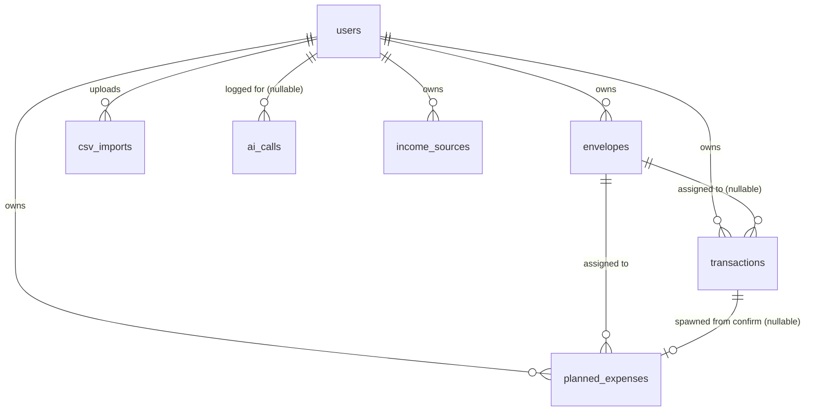

# Buddgy — Database

## Contents

| Section | What's in it |
|---|---|
| [Conventions](#conventions) | Naming, agorot rule, timestamps |
| [ERD](#erd) | Table relationships at a glance |
| [users](#users) | Auth identity, role, Google token |
| [envelopes](#envelopes) | Per-month budget buckets |
| [transactions](#transactions) | Actual spend, from any of the 3 input channels |
| [planned_expenses](#planned_expenses) | Future spend, from calendar sync or manual entry |
| [csv_imports](#csv_imports) | Audit trail of bank-statement uploads |
| [ai_calls](#ai_calls) | Usage log backing `GET /api/admin/stats`' `aiCallCount` |
| [income_sources](#income_sources) | Onboarding wizard's income step, per month |
| [Indexes](#indexes) | What's indexed and why |
| [Idempotency](#idempotency) | How duplicate imports/syncs are prevented |
| [Migration Conventions](#migration-conventions) | Naming, up/down rules |

Related specs: [`API.md`](./API.md) (what reads/writes these tables) · [`SECURITY.md`](./SECURITY.md) (row-level access rules)

---

## Conventions

- Database: **PostgreSQL**, accessed via Sequelize. See `CLAUDE.md` § Database Rules for the non-negotiables (migrations are the source of truth, transactions for multi-step writes, no `SELECT *`).
- **Local dev:** Managed automatically via the `./scripts/update-db.sh` script, which boots the `postgres:16` Docker container (matching CI) and handles migrations/seeding. See `README.md` § Getting started.
- **All monetary amounts are stored as integers in agorot** (1 ILS = 100 agorot) — never floats. Every money column is suffixed `_agorot`. Conversion to/from shekels happens only at the API/UI boundary.
- Table names: `snake_case`, plural. FKs: `<singular_table>_id`.
- `created_at` uses `DEFAULT now()` where present; this schema has no `updated_at` yet — add one via migration if a table needs edit-history later.

## ERD

## users

| Column | Type | Notes |
|---|---|---|
| id | SERIAL PK | Unique identifier |
| email | VARCHAR(255) | UNIQUE, NOT NULL |
| password_hash | VARCHAR(255) | bcrypt |
| full_name | VARCHAR(120) | |
| avatar_url | TEXT | Link to external storage (Cloudinary/S3) |
| google_refresh_token | TEXT | **Encrypted at rest**, NULL until calendar is connected — see [`SECURITY.md`](./SECURITY.md) |
| role | VARCHAR(20) | `'user'` \| `'admin'` |
| disabled | BOOLEAN | DEFAULT false — set via `PATCH /api/admin/users/:id` (ticket B-08); checked on every request in `middleware/auth.js`, not just at login, so disabling takes effect immediately (see [`API.md`](./API.md) § Admin) |
| onboarding_completed_at | TIMESTAMP | Nullable, set once via `PATCH /api/auth/onboarding` (idempotent — a second call doesn't move it). `null` is what makes the onboarding wizard (`client/src/components/onboarding/OnboardingWizardModal.jsx`) open; see [`API.md`](./API.md) § Auth |
| created_at | TIMESTAMP | DEFAULT now() |

## envelopes

| Column | Type | Notes |
|---|---|---|
| id | SERIAL PK | |
| user_id | INT FK → users | `ON DELETE CASCADE` |
| name | VARCHAR(80) | Envelope name |
| monthly_budget_agorot | INTEGER | Monthly budget in agorot |
| color | VARCHAR(7) | Display color (hex) |
| month | DATE | Month this envelope belongs to (first-of-month convention) |

**Note:** an envelope is scoped to a single month — "Groceries" for August and "Groceries" for September are two rows. This is what makes month-over-month history (`GET /api/envelopes?month=`) and per-month budgets work without a separate versioning table.

`spent_agorot` (returned by `GET /api/envelopes`, not a stored column) is computed by summing `transactions.amount_agorot` for the envelope, filtered to `transaction_date` within the envelope's own month — matching how the forecast endpoint scopes its per-envelope headroom, so the two numbers never disagree over a transaction dated outside the envelope's month.

## transactions

| Column | Type | Notes |
|---|---|---|
| id | SERIAL PK | |
| user_id | INT FK → users | `ON DELETE CASCADE` |
| envelope_id | INT FK → envelopes | `ON DELETE SET NULL` — NULL if unassigned |
| amount_agorot | INTEGER | NOT NULL |
| description | VARCHAR(255) | Original free text |
| source | VARCHAR(20) | `'quick_entry'` \| `'csv'` \| `'manual'` |
| transaction_date | DATE | NOT NULL |
| dedup_hash | VARCHAR(64) | UNIQUE — prevents duplicate import, see [Idempotency](#idempotency) |

## planned_expenses

| Column | Type | Notes |
|---|---|---|
| id | SERIAL PK | |
| user_id | INT FK → users | `ON DELETE CASCADE` |
| envelope_id | INT FK → envelopes | `ON DELETE SET NULL` — nullable until the user assigns it |
| title | VARCHAR(160) | Calendar event title, or user-entered title for a manual row |
| amount_agorot | INTEGER | Extracted from event title, or user-entered for a manual row |
| due_date | DATE | |
| google_event_id | VARCHAR(128) | UNIQUE per user (`user_id`, `google_event_id`) — prevents duplicate sync without colliding across users invited to the same Google event; NULL for manual rows |
| is_confirmed | BOOLEAN | DEFAULT false |
| source | VARCHAR(20) | `'calendar'` \| `'manual'` — DEFAULT `'calendar'` |
| transaction_id | INT FK → transactions | `ON DELETE SET NULL` — nullable; set when confirming creates the linked transaction, see [Idempotency](#idempotency) |

## csv_imports

| Column | Type | Notes |
|---|---|---|
| id | SERIAL PK | |
| user_id | INT FK → users | `ON DELETE CASCADE` |
| file_url | TEXT | Original file in external storage |
| column_mapping | JSONB | Mapping confirmed by the user |
| rows_imported | INTEGER | |
| created_at | TIMESTAMP | DEFAULT now() |

## ai_calls

| Column | Type | Notes |
|---|---|---|
| id | SERIAL PK | |
| user_id | INT FK → users | **`ON DELETE SET NULL`** — deliberately not `CASCADE` like every other user-owned table above: deleting a user must not erase historical AI usage from `/api/admin/stats`' `aiCallCount` |
| kind | VARCHAR(20) | `'quick_entry'` \| `'csv_mapping'` \| `'event_cost'` \| `'budget_advisor'` |
| succeeded | BOOLEAN | NOT NULL — failed calls (timeout, rate limit, malformed model output) still cost Anthropic spend and are still counted |
| created_at | TIMESTAMP | DEFAULT now() |

**Note:** logged from inside `server/services/claudeService.js` — the single boundary every AI call site (`parseQuickEntry`, `detectColumnMapping`, `classifyEventCostLikelihood`, and `advisorService.ask`'s tool-use loop via `runToolLoop`) goes through — never from a controller. A logging failure is caught and never allowed to break the AI feature itself (`CLAUDE.md` § Error Handling).

## income_sources

| Column | Type | Notes |
|---|---|---|
| id | SERIAL PK | |
| user_id | INT FK → users | `ON DELETE CASCADE` |
| month | DATEONLY | First-of-month convention, same as `envelopes.month` |
| label | VARCHAR(80) | e.g. "Salary", "Freelance" |
| amount_agorot | INTEGER | NOT NULL |
| sort_order | INTEGER | DEFAULT 0 — preserves the order rows were entered in on the client |

Backs the onboarding wizard's income step (`client/src/components/onboarding/IncomeStep.jsx`) and the Dashboard's income figure (`SummaryBar.jsx`) — previously client-only, stored in `localStorage` (`mockIncomeService.js`), so it never reached the DB and vanished on a different device/browser. `PUT /api/income-sources` is a full-month replace, not a per-row upsert — see [`API.md`](./API.md) § Income Sources.

## Indexes

Beyond the PK and UNIQUE indexes implied above:

| Table | Index | Why |
|---|---|---|
| `envelopes` | `(user_id, month)` | Every dashboard load filters by both — `GET /api/envelopes?month=` |
| `transactions` | `(user_id, transaction_date)` | Powers the transaction list, date filters, and forecast aggregation |
| `transactions` | `(envelope_id)` | Powers per-envelope balance calculation |
| `planned_expenses` | `(user_id, due_date)` | Powers the forecast window query |
| `planned_expenses` | `(transaction_id)` | Postgres doesn't auto-index FK child columns; `transactionService.js`'s `remove()` looks this up on every transaction delete, and the `ON DELETE SET NULL` trigger scans it too |
| `income_sources` | `(user_id, month)` | Every `GET`/`PUT` filters by both — same reasoning as envelopes' `(user_id, month)` index |

Add these as part of the initial migration, not as an afterthought — the forecast and dashboard queries are the hottest paths in the app.

## Idempotency

Two UNIQUE constraints exist specifically to make retryable operations safe:

- **`transactions.dedup_hash`** — computed from `(user_id, amount_agorot, transaction_date, description)` at import time. Re-uploading the same CSV must skip rows whose hash already exists, and report the skip count (`duplicatesSkipped` in `POST /api/imports/:id/confirm`).
- **`planned_expenses.google_event_id`** — re-running `POST /api/calendar/sync` must `UPSERT` (insert-or-update) on the `(user_id, google_event_id)` pair, never blind-insert. Scoped to `user_id` because Google assigns the same event id to every attendee of a shared event — a global unique would let one user's sync overwrite another's row.

Both are enforced at the DB level (`UNIQUE`), but the service layer must also handle the constraint violation gracefully — see `CLAUDE.md` § Database Rules and `.claude/commands/qa.md` § Buddgy Critical Test Cases.

**Confirming a planned expense** (`PATCH /api/planned-expenses/:id` with `is_confirmed: true`) is idempotent by transition, not by a UNIQUE constraint: `server/services/plannedExpenseService.js`'s `update()` only creates the linked `transaction_id` row when `is_confirmed` actually flips `false → true`, so re-confirming an already-confirmed row is a no-op. Both the row update and the transaction create/delete happen inside one `sequelize.transaction`, so a failure at any step leaves nothing partially applied. Unconfirming (`true → false`) deletes the linked transaction and clears `transaction_id` — a destructive, deliberate reversal, not a soft unlink.

**Editing an already-confirmed row** (envelope/amount/title/due_date changed without touching `is_confirmed`) mirrors the same field changes onto the linked transaction in the same DB transaction, so the two rows can't drift apart — e.g. reassigning a confirmed row's envelope moves the transaction's spend with it.

**Deleting the link from either side keeps both rows honest, symmetrically:**
- Deleting a **confirmed planned expense** (`DELETE /api/planned-expenses/:id`) also deletes its linked transaction, inside one `sequelize.transaction` — otherwise the transaction would be orphaned (still `source: 'planned_expense'`, but nothing pointing at it).
- Deleting the **linked transaction** (`DELETE /api/transactions/:id`) reverts the planned expense to `is_confirmed: false, transaction_id: null` instead of leaving it stuck confirmed-with-no-transaction. This runs before the row destroy, ahead of the FK's `ON DELETE SET NULL`, so the service — not the trigger — decides the resulting state. The `transaction_id IS NULL` filter used by `forecastService.js`'s planned-expense sums (see `docs/ARCHITECTURE.md` § Forecast Computation) then only ever matches genuine legacy rows confirmed before this link existed, not rows whose transaction was deleted out from under them.

## Migration Conventions

- One migration per schema change, named `YYYYMMDD-<verb>-<what>` (e.g. `20260809-create-envelopes-table`).
- Every migration has a complete `down`.
- Foreign keys and the indexes above are added in the same migration as the table, not deferred.
- Seeders (`server/seeders/`) provide demo data for local dev via `npm run db:seed:dev` and for the Day 12 demo — see [`PLAN.md`](./PLAN.md).
- The `categories` table (global admin catalog: `name_he`/`name_en`/`color`/`is_active`) was dropped in migration `20260820000400-drop-categories.js` — it was never wired to any feature (`server/services/claudeService.js` classifies against the user's `envelopes` only, and `transactions` has no column to persist a category label), so it sat as dead schema behind an admin CRUD screen that changed nothing. `envelopes` remains the only budgeting concept in the schema; the client UI's "Category" label refers to it (`docs/PLAN.md` ticket A-06).
