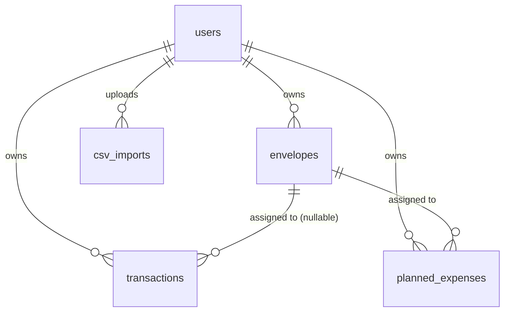

# Buddgy — Database

## Contents

| Section | What's in it |
|---|---|
| [Conventions](#conventions) | Naming, agorot rule, timestamps |
| [ERD](#erd) | Table relationships at a glance |
| [users](#users) | Auth identity, role, Google token |
| [envelopes](#envelopes) | Per-month budget buckets |
| [transactions](#transactions) | Actual spend, from any of the 3 input channels |
| [planned_expenses](#planned_expenses) | Future spend synced from Google Calendar |
| [csv_imports](#csv_imports) | Audit trail of bank-statement uploads |
| [Indexes](#indexes) | What's indexed and why |
| [Idempotency](#idempotency) | How duplicate imports/syncs are prevented |
| [Migration Conventions](#migration-conventions) | Naming, up/down rules |

Related specs: [`API.md`](./API.md) (what reads/writes these tables) · [`SECURITY.md`](./SECURITY.md) (row-level access rules)

---

## Conventions

- Database: **PostgreSQL**, accessed via Sequelize. See `CLAUDE.md` § Database Rules for the non-negotiables (migrations are the source of truth, transactions for multi-step writes, no `SELECT *`).
- **All monetary amounts are stored as integers in agorot** (1 ILS = 100 agorot) — never floats. Every money column is suffixed `_agorot`. Conversion to/from shekels happens only at the API/UI boundary.
- Table names: `snake_case`, plural. FKs: `<singular_table>_id`.
- `created_at` uses `DEFAULT now()` where present; this schema has no `updated_at` yet — add one via migration if a table needs edit-history later.

## ERD

## users

| Column | Type | Notes |
|---|---|---|
| id | SERIAL PK | Unique identifier |
| email | VARCHAR(255) | UNIQUE, NOT NULL |
| password_hash | VARCHAR(255) | bcrypt |
| full_name | VARCHAR(120) | |
| avatar_url | TEXT | Link to external storage (Cloudinary/S3) |
| google_refresh_token | TEXT | **Encrypted at rest**, NULL until calendar is connected — see [`SECURITY.md`](./SECURITY.md) |
| role | VARCHAR(20) | `'user'` \| `'admin'` |
| created_at | TIMESTAMP | DEFAULT now() |

## envelopes

| Column | Type | Notes |
|---|---|---|
| id | SERIAL PK | |
| user_id | INT FK → users | `ON DELETE CASCADE` |
| name | VARCHAR(80) | Envelope name |
| monthly_budget_agorot | INTEGER | Monthly budget in agorot |
| color | VARCHAR(7) | Display color (hex) |
| month | DATE | Month this envelope belongs to (first-of-month convention) |

**Note:** an envelope is scoped to a single month — "Groceries" for August and "Groceries" for September are two rows. This is what makes month-over-month history (`GET /api/envelopes?month=`) and per-month budgets work without a separate versioning table.

## transactions

| Column | Type | Notes |
|---|---|---|
| id | SERIAL PK | |
| user_id | INT FK → users | `ON DELETE CASCADE` |
| envelope_id | INT FK → envelopes | `ON DELETE SET NULL` — NULL if unassigned |
| amount_agorot | INTEGER | NOT NULL |
| description | VARCHAR(255) | Original free text |
| source | VARCHAR(20) | `'quick_entry'` \| `'csv'` \| `'manual'` |
| transaction_date | DATE | NOT NULL |
| dedup_hash | VARCHAR(64) | UNIQUE — prevents duplicate import, see [Idempotency](#idempotency) |

## planned_expenses

| Column | Type | Notes |
|---|---|---|
| id | SERIAL PK | |
| user_id | INT FK → users | `ON DELETE CASCADE` |
| envelope_id | INT FK → envelopes | `ON DELETE SET NULL` — nullable until the user assigns it |
| title | VARCHAR(160) | Calendar event title |
| amount_agorot | INTEGER | Extracted from event title |
| due_date | DATE | |
| google_event_id | VARCHAR(128) | UNIQUE — prevents duplicate sync |
| is_confirmed | BOOLEAN | DEFAULT false |

## csv_imports

| Column | Type | Notes |
|---|---|---|
| id | SERIAL PK | |
| user_id | INT FK → users | `ON DELETE CASCADE` |
| file_url | TEXT | Original file in external storage |
| column_mapping | JSONB | Mapping confirmed by the user |
| rows_imported | INTEGER | |
| created_at | TIMESTAMP | DEFAULT now() |

## Indexes

Beyond the PK and UNIQUE indexes implied above:

| Table | Index | Why |
|---|---|---|
| `envelopes` | `(user_id, month)` | Every dashboard load filters by both — `GET /api/envelopes?month=` |
| `transactions` | `(user_id, transaction_date)` | Powers the transaction list, date filters, and forecast aggregation |
| `transactions` | `(envelope_id)` | Powers per-envelope balance calculation |
| `planned_expenses` | `(user_id, due_date)` | Powers the forecast window query |

Add these as part of the initial migration, not as an afterthought — the forecast and dashboard queries are the hottest paths in the app.

## Idempotency

Two UNIQUE constraints exist specifically to make retryable operations safe:

- **`transactions.dedup_hash`** — computed from `(user_id, amount_agorot, transaction_date, description)` at import time. Re-uploading the same CSV must skip rows whose hash already exists, and report the skip count (`duplicatesSkipped` in `POST /api/imports/:id/confirm`).
- **`planned_expenses.google_event_id`** — re-running `POST /api/calendar/sync` must `UPSERT` (insert-or-update) on this column, never blind-insert.

Both are enforced at the DB level (`UNIQUE`), but the service layer must also handle the constraint violation gracefully — see `CLAUDE.md` § Database Rules and `.claude/commands/qa.md` § Buddgy Critical Test Cases.

## Migration Conventions

- One migration per schema change, named `YYYYMMDD-<verb>-<what>` (e.g. `20260809-create-envelopes-table`).
- Every migration has a complete `down`.
- Foreign keys and the indexes above are added in the same migration as the table, not deferred.
- Seeders (`server/seeders/`) provide demo data for local dev and for the Day 12 demo — see [`PLAN.md`](./PLAN.md).
